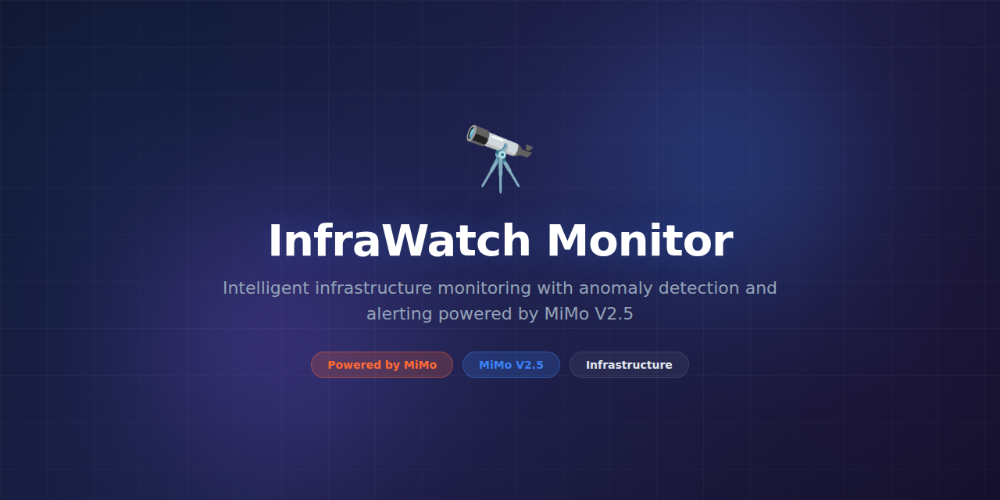

# InfraWatch-Monitor



> **Powered by MiMo** — built on top of Xiaomi's [MiMo](https://platform.xiaomimimo.com) reasoning models for intelligent infrastructure anomaly detection and predictive alerting.

[](https://opensource.org/licenses/MIT)
[](https://platform.xiaomimimo.com)

---

## Why MiMo

Infrastructure monitoring tools are excellent at collecting metrics — CPU, memory, disk, network, latency — but they're notoriously bad at understanding what those metrics *mean* together. A CPU spike at 3 AM might be a cron job or the beginning of a cascading failure. MiMo V2.5 reasons across multiple metric dimensions simultaneously, correlating signals that threshold-based alerting would treat as independent events.

MiMo's strength lies in its ability to build contextual understanding of infrastructure behavior. It learns that a gradual memory increase combined with a slowly climbing p99 latency on a specific service correlates with a connection leak pattern it has seen before. This kind of multi-signal pattern recognition requires the deep reasoning capabilities that MiMo V2.5 provides, going far beyond what statistical anomaly detection alone can achieve.

Predictive alerting is where MiMo truly differentiates. Instead of alerting when a threshold is breached (by which point users are already affected), MiMo projects current trajectories forward and alerts engineers when it predicts a breach within the next 30-60 minutes. This shifts operations from reactive firefighting to proactive capacity management, giving teams time to respond before impact occurs.

---

## Token Consumption

| Agent | Model | Tokens/run | Frequency | Daily/user |
|---|---|---|---|---|
| Anomaly Detector | MiMo V2.5 | 3,000 | Per minute | ~4,320,000 |
| Context Correlator | MiMo V2.5 | 4,500 | Per anomaly | ~50,000 |
| Predictive Scorer | MiMo V2.5 | 2,800 | Per 5min | ~806,400 |

---

## What it does

InfraWatch-Monitor collects metrics from Prometheus, Datadog, CloudWatch, and custom sources, then applies MiMo-powered reasoning to detect anomalies, correlate cross-service issues, and predict failures before they happen. It generates actionable alerts with full context — not just "CPU is high" but "CPU is climbing at a rate that predicts saturation in 45 minutes, correlated with memory pressure on the same host."

---

## Why this exists

Modern infrastructure generates thousands of metric streams. Teams drown in false-positive alerts while genuine incidents go unnoticed until users complain. InfraWatch-Monitor exists to replace noisy threshold alerts with intelligent, context-aware incident detection that understands infrastructure holistically and alerts only when it matters.

---

## Features

- **Multi-source metric collection** — Prometheus, Datadog, CloudWatch, StatsD, custom exporters
- **MiMo-powered anomaly detection** — contextual, multi-signal analysis
- **Predictive alerting** — warns before thresholds are breached
- **Cross-service correlation** — connects related anomalies across microservices
- **Auto-baselining** — learns normal behavior per service, no manual thresholds
- **Alert fatigue reduction** — deduplicates and groups related alerts
- **Runbook suggestions** — generates troubleshooting steps based on detected patterns
- **Grafana plugin** — native dashboard integration
- **SLO tracking** — monitors service level objectives and error budgets
- **Capacity planning** — forecasts resource needs based on current growth trends

---

## Tech Stack

- **Python 3.11+** — core runtime
- **MiMo V2.5** — anomaly detection and predictive reasoning via Xiaomi API
- **Prometheus** — primary metrics collection backend
- **TimescaleDB** — time-series storage for historical analysis
- **FastAPI** — REST API and webhook receiver
- **Celery** — background task processing
- **Redis** — alert deduplication and caching
- **Grafana** — dashboard visualization
- **Docker & Kubernetes** — deployment

---

## Quickstart

```bash
# Clone and install
git clone https://github.com/yuroo-shield/InfraWatch-Monitor.git
cd InfraWatch-Monitor
pip install -e ".[dev]"

# Set your MiMo API key
export MIMO_API_KEY="your-key-here"

# Start with Docker Compose
docker-compose up -d

# Configure a Prometheus data source
infrawatch config add-source \
  --type prometheus \
  --url http://localhost:9090 \
  --name "local-prometheus"

# Start monitoring
infrawatch monitor start \
  --predictive \
  --alert-webhook https://hooks.slack.com/...

# Check current anomaly score
infrawatch status --verbose

# View capacity forecast
infrawatch forecast --service api-server --horizon 30d
```

---

## Project Structure

```
InfraWatch-Monitor/
├── assets/
│   └── banner.png
├── infrawatch/
│   ├── __init__.py
│   ├── collector.py       # Multi-source metric collection
│   ├── detector.py        # MiMo-powered anomaly detection
│   ├── correlator.py      # Cross-service correlation
│   ├── predictor.py       # Predictive alerting engine
│   ├── alerter.py         # Alert management and dispatch
│   ├── baseliner.py       # Auto-baselining engine
│   ├── slo.py             # SLO tracking and error budgets
│   └── config.py          # Configuration management
├── plugins/
│   ├── prometheus.py
│   ├── datadog.py
│   ├── cloudwatch.py
│   └── grafana.py
├── tests/
│   ├── test_detector.py
│   ├── test_predictor.py
│   ├── test_correlator.py
│   └── conftest.py
├── docker-compose.yml
├── k8s/
│   ├── deployment.yaml
│   └── service.yaml
├── pyproject.toml
└── README.md
```

---

## Contributing

We welcome contributions! Please see [CONTRIBUTING.md](CONTRIBUTING.md) for guidelines. Run the test suite before submitting PRs:

```bash
# Run tests
pytest tests/ -v

# Run with coverage
pytest tests/ --cov=infrawatch --cov-report=html
```

---

## License

This project is licensed under the MIT License — see the [LICENSE](LICENSE) file for details.
